# Casa Dolce Vita
(Developer: Kamil Wojciechowski)

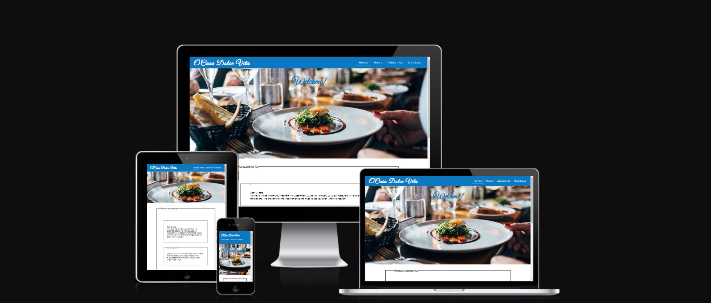

[Live webpage](https://wojtekkamilowski.github.io/CI_PP1_CDVMR/)

## Table of Content

1. [Project Goals](#project-goals)
    -[User Goals](#user-goals)
    - [Business Owner Goals](#site-owner-goals)
2. [User Experience](#user-experience)
    - [Target Audience](#target-audience)
    - [User Requirements and Expectations](#user-requirements-and-expectations)
    - [User Stories](#user-stories)
3. [Design](#design)
    - [Design Choices](#design-choices)
    - [Color](#colors)
    - [Fonts](#fonts)
    - [Structure](#structure)
    - [Wireframes](#wireframes)
4. [Technologies Used](#technologies-used)
    - [Languages](#languages)
    - [Frameworks & Tools](#frameworks-&-tools)
5. [Features](#features)
6. [Testing](#validation)
    - [HTML Validation](#HTML-validation)
    - [CSS Validation](#CSS-validation)
    - [Accessibility](#accessibility)
    - [Performance](#performance)
    - [Device testing](#performing-tests-on-various-devices)
    - [Browser compability](#browser-compability)
    - [Testing user stories](#testing-user-stories)
 7. [Bugs](#Bugs)
 8. [Deployment](#deployment)
 9. [Credits](#credits)
 10. [Acknowledgements](#acknowledgements)

## Project Goals

### User Goals
- Find a restaurant located in Cork city which offers a unique dining experience from mediterranean cuisines. 
- Find the exact location of the restaurant and the neighbouring area with a scenic vie of the city where it is located.
- Find useful information: important notices (e.g. about a temporary closure due to a refurbishment), special offers or opening hours.
- Get a feeling of what type of atmosphere, food offer, pricing range, building interior to expect during the visit in the restaurant.
- Understand the name of the restaurant which originates from different languages than the most commonly used in the country where it is located. 
- Communicate with the restaurant management to provide feedback, ask questions or suggest some changes.

### Business Owner Goals
- Present the establishment for a potential customer.
- Convince users to visit the restaurant by letting them familiarise with the product and feel welcomed to visit.
- Inform users about important notices, special offers and when the restaurant can be visited.
- Receive feedback/questions/suggestions and collect contact details to possibly address them when needed.

## User Experience

### Target Audience

- People who would like to visit a mediterranean restaurant in Cork.
- Individuals, couples or groups who would like to try a different type of food originating from abroad. 
- People who are looking for a scenic spot to eat with the view of Cork city.
- Customers who already visited the restaurant and would like to contact the business.

### User Requirements and Expectations

- Accessible website.
- Intutive website wtih a layout allowing to easily navigate through it.
- Easy access to useful information. 
- Links and features that function in accordance with their intended purpose. 
- Welcoming visual appearance which follows the principles of responsive design.
- Easy to understand and informative content.
- A simple mean of contacting the staff.

### User Stories

### First-time User

As a first time user I want to:

1. Know if there is some disruption to the usual opening times or other very important information. 
2. Know when I can visit the place.
3. Know how to contact the restaurant via phone or email.
4. Know the address of the premises. 
5. Visit restaurant's social media platforms and check the activity on them.

#### Returning User

As a returning user I want to:

6. Contact the management and inform about my feedback after a visit.
7. Check if there is a special offer available. 
8. Check if the restaurant menu is same as during the last visit.

### Business Owner 

As the restaurant owner I want to:

9. Advertise the place through presentation of food and drink served. 
10. Introduce what type of place the user can expect during the visit.
11. Reveal the interior design of the restaurant. 
12. Present the head chef to the user.
13. Inform the user who manages preparation of the dishes and the professional background of this person. 
14. Share other guets reviews and what they felt during their dining experience. 
15. Explain how to get to the restaurant and present its unique location. 

## Design

### Design Choices 
The main thought when designing the website was to introduce the restaurant as a fresh, welcoming, and warm place in a contemporary style with a mediterranean inspiration.
The logo contains a lemon icon for users to associate the place with the freshness of this fruit commonly grown in the mediterranean region.
Restaurant's name displayed in the logo "Casa Dolce Vita" is a combination of "casa" which in latin languages means "house" to let the user associate it with the warm and welcoming atmosphere of home, and "dolce vita" from Italian "sweet life" to suggest a tasteful dining experience.
On the top of the home page the user can observe the word "Welcome!" with a dish plate in the background to feel the website has been designed for the users to eventually bring them to the introduced dining experience, stimulating consumer expectations and curiosity to visit the place which is aimed to add a marketing value for the business owner as a mean of gaining possible competitive advantage over the competition.
Images on the menu page were chosen to present the food served in aesthetic way representing the quality of the product. 
On the About us page the user can get to known the chef and restaurant's interior which was aimed to represent the friendly environment of the establishment and its staff. 
The design choice for other elements of the website such Announcements, Opening hours, Food/Drinks Menus, Our Place/Chef/Guests, the contact form and the map was decided to clearly display relevant information for the user in a simple and easy to understand way.

### Color
The chosen color scheme was a combination of white and blue tones which is to symbolize the mediterranean theme, they are the colors of the mediterranean sea, and white houses which could be well known as a part of the Greek landscape. The initially chosen blue color was found on color-hex.com and was different to the one on the final version of the website as it was changed during accessibility tests and checking their contrast on WebAIM. 

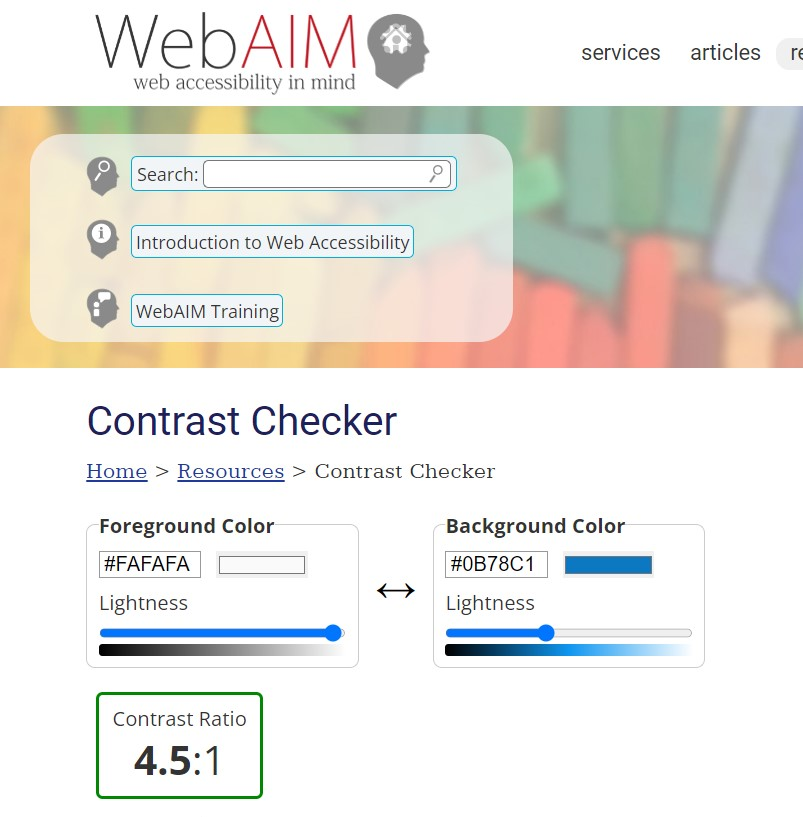

### Fonts
Fonts were found using fonts.google.com
The font chosen for the logo h1 and the Welcome h2 was _Great Vibes_ to match the mediterranean theme of the restaurant. 
For h2, h3, nav id menu a, footer, class cuisine type p on the menu page, and class message-box legend elements _Raleway_ was used to differenciate them.
The font chosen for the body was _Roboto_.
_Sans-serif_ was chosen as the fallback font for all elements.

### Structure
The structure was chosen to follow the common pattern of placing the website logo in the top left corner and the navigation links on the top right corner of the website.
There are four pages that are parts of the website:
- Home with two sections: first is the Welcome! h2 with its food_plate image in the background and second with id notice-board containing Announcements and Opening hours.
- Menu presenting the menu carte with food served in three distinctive divs id: restaurant-menu-header, menu-images and restaurant-menu.
- About us with three sections for Our Place, Our Chef and Our Guests.
- Contact consisting with a contact form and an iframe map.

## Wireframes

Home

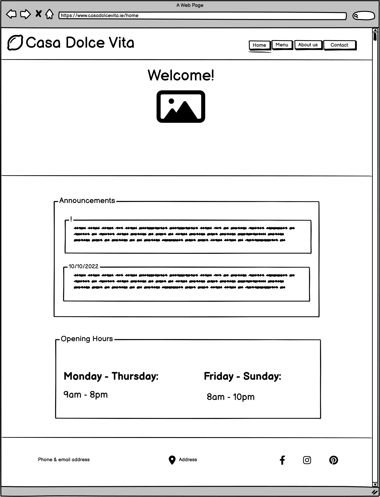
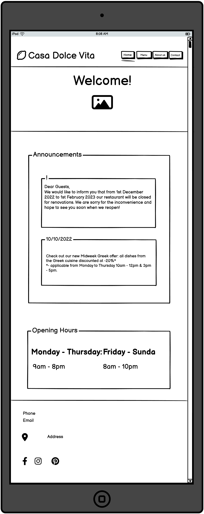
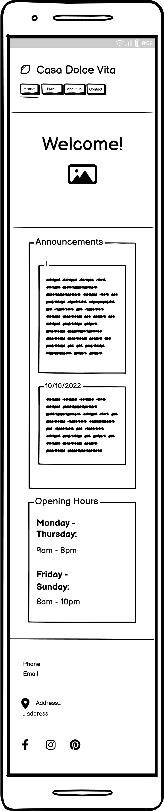

Menu

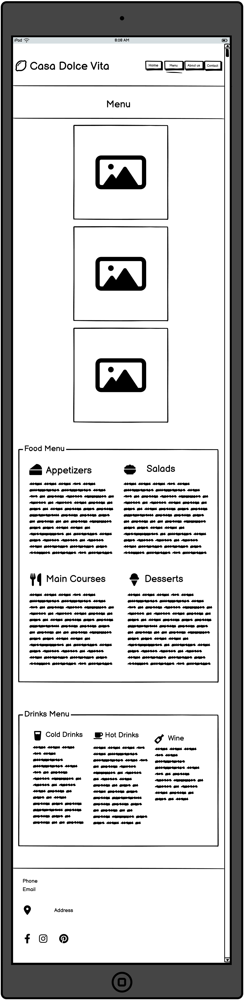
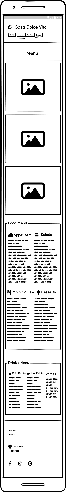

About us

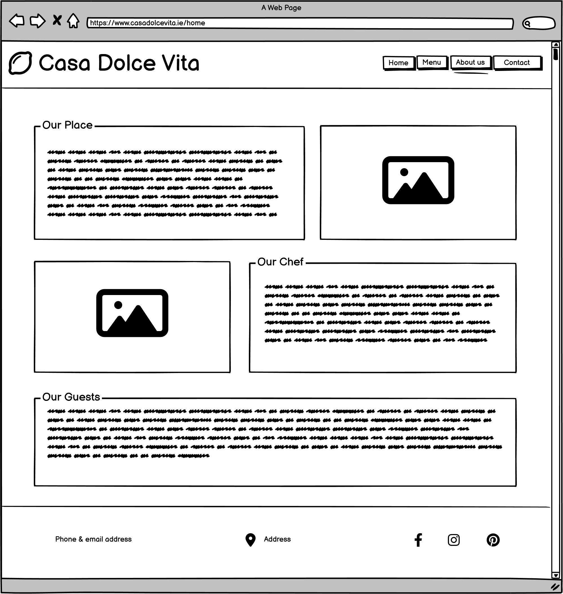
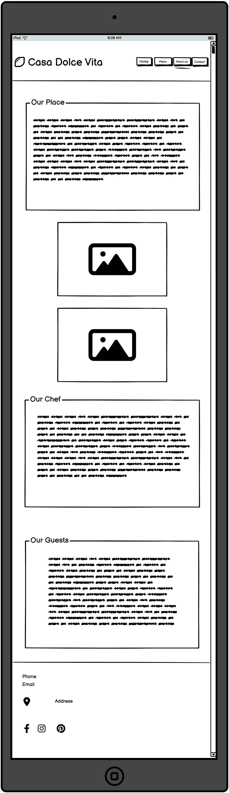
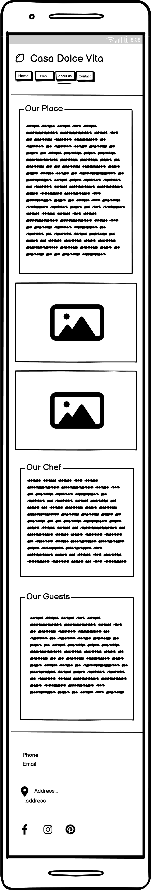

Contact

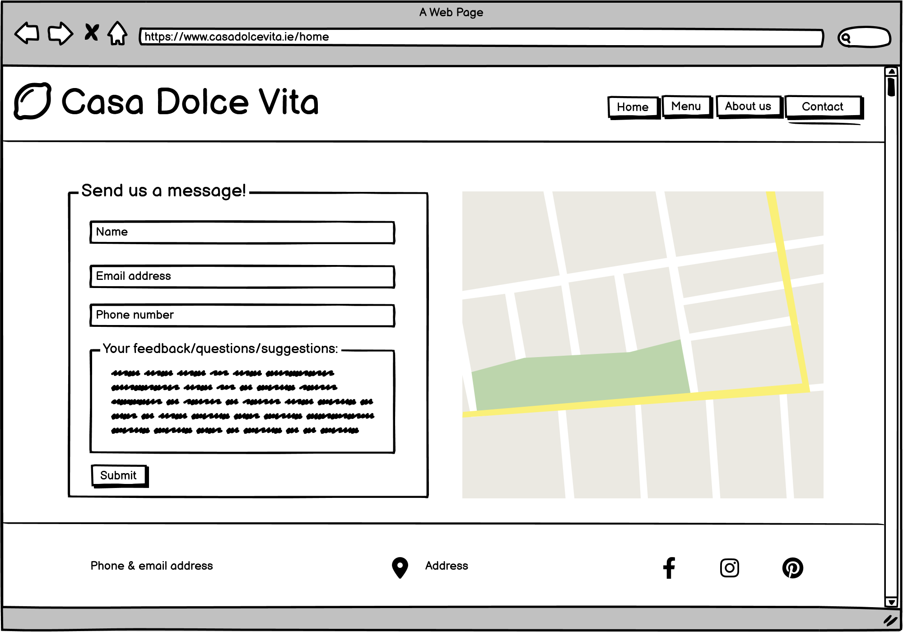
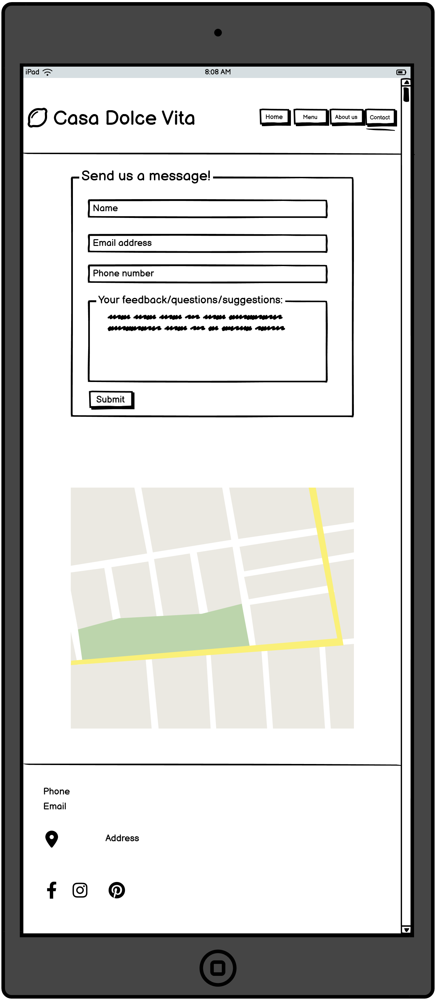
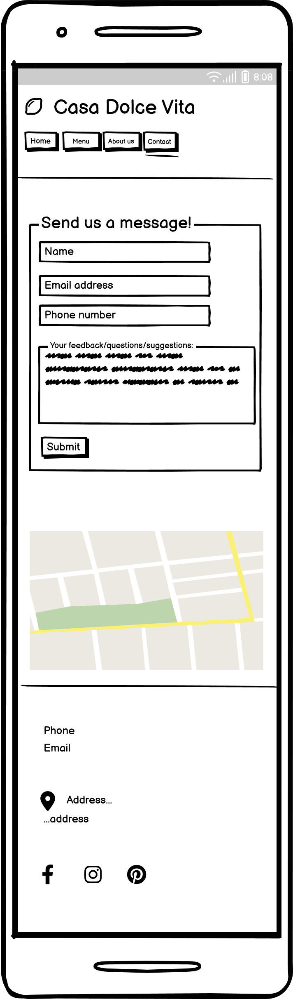

404

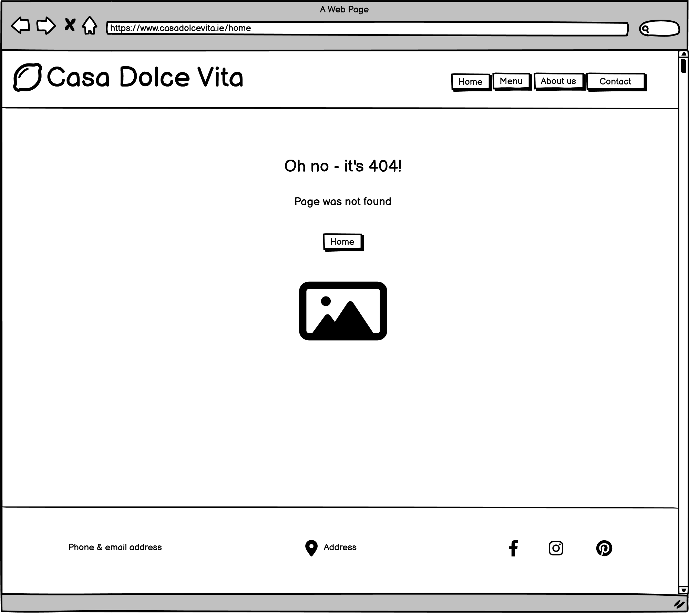
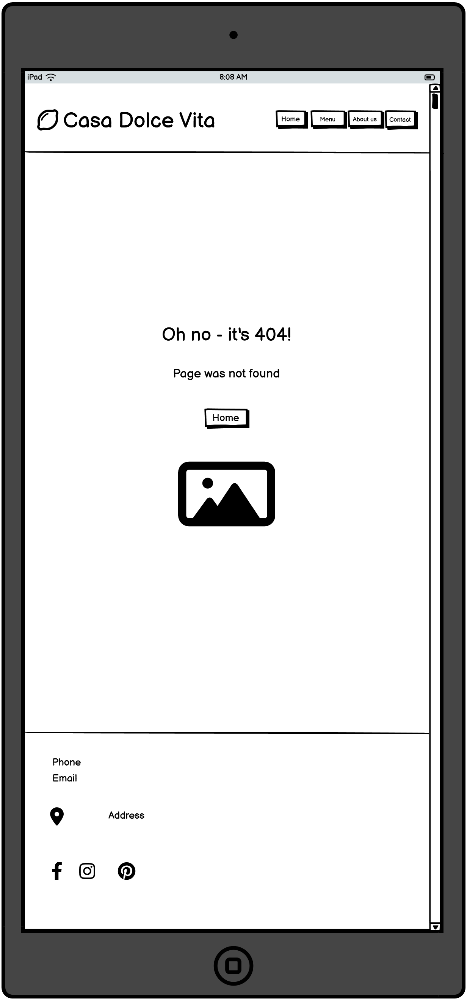
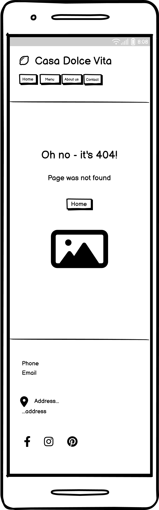

## Languages
- HTML
- CSS

## Technologies Used
- GitHub
- Gitpod
- Balsamiq - to create the wireframes.
- Font Awesome - to add logo, address, social media, and restaurant menu icons.
- favicon.io - to create the favicon.
- Google Maps to add the link to the map.
- Google Fonts to find and add Great Vibes, Raleway and Roboto fonts. 
- TinyPNG to compress the images.
- color-hex to find the initial color's hex value.
- WebAIM to identify the color that would match the design choice and accessibility requirements. 

## Features
On the website there are four pages with fourteen features in total.

### Logo and Navigation Bar
- It is included on all four pages.
- The logo consists of the icon and restaurant's name is a clickable link to Home page which is a common feature and users expect it.
- On the right there are four links to each of the pages: Home, Menu, About us and Contact so the user can easily navigate through.
- To indicate for the user on which page is currently viewed it is underlined. 
- When the user hovers the mouse over the other pages links it also underlines informing the user that the link will bring to the named page.
- Logo and Navigation Bar are responsive, the page links slide to the left under the logo for smaller screens.
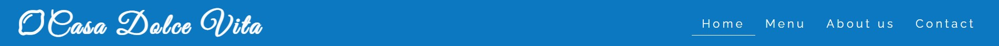

### Footer 
- Appears on all four pages.
- Divided by three divs with their id: phone-email, address and social. 
- div id phone-email displays restaurant's phone number and email address on the left side.
- In the center of the footer there is div id address consists of the location dot icon and restaurant's location address and clicking it links to the map view on Google Maps opened in a new tab.
- From the right side of the id social div, there are icons with clickable links to the social media.
- Footer is responsive, id address and social divs slide under the id phone-email div from footer's top to its bottom. 

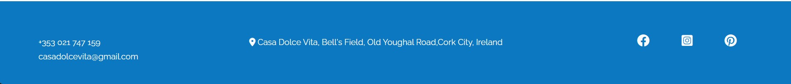

### Ann

  

    
