# Casa Dolce Vita
(Developer: Kamil Wojciechowski)

[Live webpage](https://wojtekkamilowski.github.io/CI_PP1_CDVMR/)

## Table of Content

1. [Project Goals](#project-goals)
    -[User Goals](#user-goals)
    - [Business Owner Goals](#site-owner-goals)
2. [User Experience](#user-experience)
    - [Target Audience](#target-audience)
    - [User Requirements and Expectations](#user-requirements-and-expectations)
    - [User Stories](#user-stories)
3. [Design](#design)
    - [Design Choices](#design-choices)
    - [Color](#colors)
    - [Fonts](#fonts)
    - [Structure](#structure)
    - [Wireframes](#wireframes)
4. [Technologies Used](#technologies-used)
    - [Languages](#languages)
    - [Frameworks & Tools](#frameworks-&-tools)
5. [Features](#features)
6. [Validation](#validation)
    - [HTML Validation](#HTML-validation)
    - [CSS Validation](#CSS-validation)
    - [Accessibility](#accessibility)
    - [Performance](#performance)
    - [Device testing](#performing-tests-on-various-devices)
    - [Browser compability](#browser-compability)
    - [Testing user stories](#testing-user-stories)
 7. [Bugs](#Bugs)
 8. [Deployment](#deployment)
 9. [Credits](#credits)
 10. [Acknowledgements](#acknowledgements)

## Project Goals

### User Goals
- Find a restaurant located in Cork city which offers a unique dining experience from mediterranean cuisines. 
- Find the exact location of the restaurant and the neighbouring area with a scenic vie of the city where it is located.
- Find useful information: important notices (e.g. about a temporary closure due to a refurbishment), special offers or opening hours.
- Get a feeling of what type of atmosphere, food offer, pricing range, building interior to expect during the visit in the restaurant.
- Understand the name of the restaurant which originates from different languages than the most commonly used in the country where it is located. 
- Communicate with the restaurant management to provide feedback, ask questions or suggest some changes.

### Business Owner Goals
- Present the establishment for a potential customer.
- Convince users to visit the restaurant by letting them familiarise with the product and feel welcomed to visit.
- Inform users about important notices, special offers and when the restaurant can be visited.
- Receive feedback/questions/suggestions and collect contact details to possibly address them when needed.

## User Experience

### Target Audience

- People who would like to visit a mediterranean restaurant in Cork.
- Individuals, couples or groups who would like to try a different type of food originating from abroad. 
- People who are looking for a scenic spot to eat with the view of Cork city.
- Customers who already visited the restaurant and would like to contact the business.

### User Requirements and Expectations

- Accessible website.
- Intutive website wtih a layout allowing to easily navigate through it.
- Easy access to useful information. 
- Links and features that function in accordance with their intended purpose. 
- Welcoming visual appearance which follows the principles of responsive design.
- Easy to understand and informative content.
- A simple mean of contacting the staff.

### User Stories

#### First-time User

As a first time user I want to:

1. Know if there is some disruption to the usual opening times or other very important information. 
2. Know when I can visit the place.
3. Know how to contact the restaurant via phone or email.
4. Know the address of the premises. 
5. Visit restaurant's social media platforms and check the activity on them.

#### Returning User

As a returning user I want to:

6. Contact the management and inform about my feedback after a visit.
7. Check if there is a special offer available. 
8. Check if the restaurant menu is same as during the last visit.

#### Business Owner 

As the restaurant owner I want to:

9. Advertise the place through presentation of food and drink served. 
10. Introduce what type of place the user can expect during the visit.
11. Reveal the interior design of the restaurant. 
12. Present the head chef to the user.
13. Inform the user who manages preparation of the dishes and the professional background of this person. 
14. Share other guets reviews and what they felt during their dining experience. 
15. Explain how to get to the restaurant and present its unique location. 
16. Make the user feel welcomed and invited to visit the restaurant.

## Design

### Design Choices 
The main thought when designing the website was to introduce the restaurant as a fresh, welcoming, and warm place in a contemporary style with a mediterranean inspiration.
The logo contains a lemon icon for users to associate the place with the freshness of this fruit commonly grown in the mediterranean region.
Restaurant's name displayed in the logo "Casa Dolce Vita" is a combination of "casa" which in latin languages means "house" to let the user associate it with the warm and welcoming atmosphere of home, and "dolce vita" from Italian "sweet life" to suggest a tasteful dining experience.
On the top of the home page the user can observe the word "Welcome!" with a dish plate in the background to feel the website has been designed for the users to eventually bring them to the introduced dining experience, stimulating consumer expectations and curiosity to visit the place which is aimed to add a marketing value for the business owner as a mean of gaining possible competitive advantage over the competition.
Images on the menu page were chosen to present the food served in aesthetic way representing the quality of the product. 
On the About us page the user can get to known the chef and restaurant's interior which was aimed to represent the friendly environment of the establishment and its staff. 
The design choice for other elements of the website such Announcements, Opening hours, Food/Drinks Menus, Our Place/Chef/Guests, the contact form and the map was decided to clearly display relevant information for the user in a simple and easy to understand way.

### Color
The chosen color scheme was a combination of white and blue tones which is to symbolize the mediterranean theme, they are the colors of the mediterranean sea, and white houses which could be well known as a part of the Greek landscape. The initially chosen blue color was found on color-hex.com and was different to the one on the final version of the website as it was changed during accessibility tests and checking their contrast on WebAIM. 

### Fonts
Fonts were found using fonts.google.com
The font chosen for the logo h1 and the Welcome h2 was _Great Vibes_ to match the mediterranean theme of the restaurant. 
For h2, h3, nav id menu a, footer, class cuisine type p on the menu page, and class message-box legend elements _Raleway_ was used to differenciate them.
The font chosen for the body was _Roboto_.
_Sans-serif_ was chosen as the fallback font for all elements.

### Structure
The structure was chosen to follow the common pattern of placing the website logo in the top left corner and the navigation links on the top right corner of the website.
There are four pages that are parts of the website:
- Home with two sections: first is the Welcome! h2 with its food_plate image in the background and second with id notice-board containing Announcements and Opening hours.
- Menu presenting the menu carte with food served in three distinctive divs id: restaurant-menu-header, menu-images and restaurant-menu.
- About us with three sections for Our Place, Our Chef and Our Guests.
- Contact consisting with a contact form and an iframe map.

## Wireframes

    
Home

    
    
    

    
Menu

    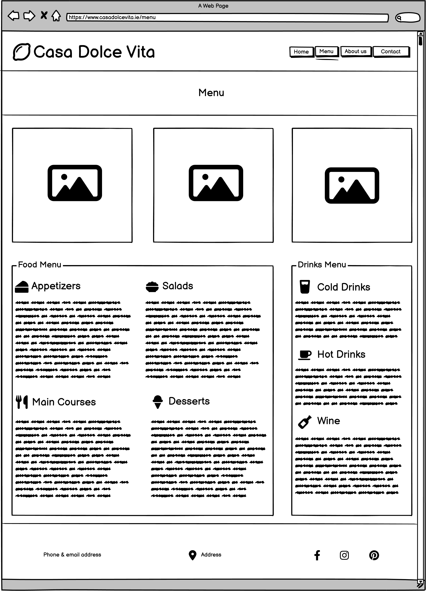
    
    

    
About us

    
    
    

    
Contact

    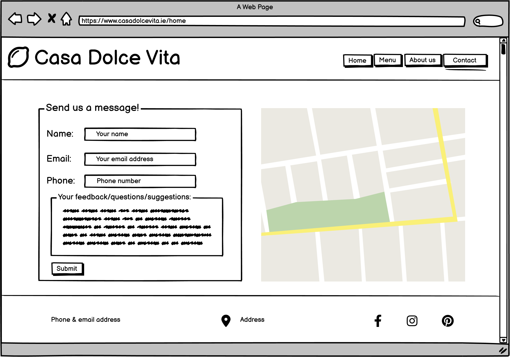
    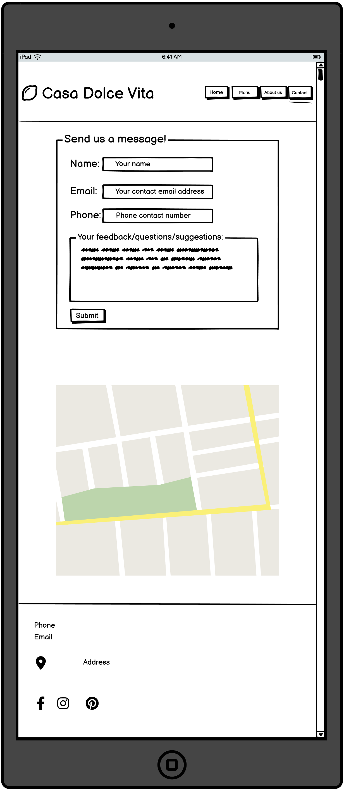
    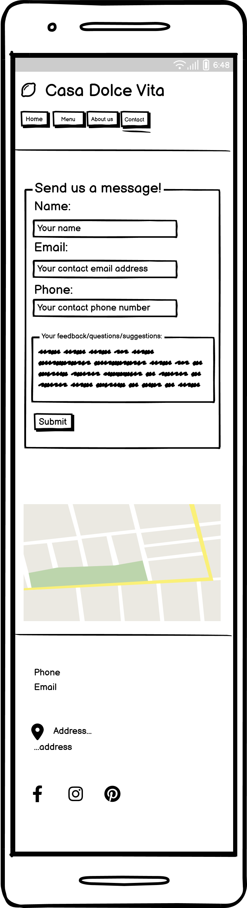

    
404

    
    
    

## Languages
- HTML
- CSS

## Technologies Used
- GitHub
- Gitpod
- Balsamiq - to create the wireframes.
- Font Awesome - to add logo, address, social media, and restaurant menu icons.
- favicon.io - to create the favicon.
- Google Maps to add the link to the map.
- Google Fonts to find and add Great Vibes, Raleway and Roboto fonts. 
- TinyPNG to compress the images.
- color-hex to find the initial color's hex value.
- WebAIM to identify the color that would match the design choice and accessibility requirements. 

## Features
On the website there are four pages with twelve features in total.

    
Logo and Navigation Bar
  
    It is included on all four pages.  
    The logo consists of the icon and restaurant's name is a clickable link to Home page which is a common feature and users expect it.  
    On the right there are four links to each of the pages: Home, Menu, About us and Contact so the user can easily navigate through.  
    To indicate for the user on which page is currently viewed it is underlined.  
    When the user hovers the mouse over the other pages links it also underlines informing the user that the link will bring to the named page.  
    Logo and Navigation Bar are responsive, the page links slide to the left under the logo for smaller screens. 
    User stories covered: 6, 8, 9, 10, 11, 12, 13, 14, 15.
    

 

    
Footer
 
    Appears on all four pages. 
    Divided by three divs with their id: phone-email, address and social.  
    div id phone-email displays restaurant's phone number and email address on the left side. 
    In the center of the footer there is div id address consists of the location dot icon and restaurant's location address and clicking it links to the map view on       Google Maps opened in a new tab. 
    From the right side of the id social div, there are icons with clickable links to the social media. Footer is responsive, id address and social divs slide under       the id phone-email div from footer's top to its bottom. 
    User stories covered: 3, 4, 5. 
    

   
    
Plate image
     
    Placed on the top of the Home page. 
    Displays "Welcome!" h2 on the top center with a plate image in the background welcoming the user to the website and the restaurant.  
    It is responsive, the background image is resized and font-size reduced for smaller screens. 
    User stories covered: 9, 16. 
    

    
Announcements

    Included on the Home page in the center of its section, under the plate image feature.  
    Consists of two notifications displayed in the fieldsets for the user: the first one with its legend "!" an important urgent notice regarding a temporary               closure, and the other one is a special offer of the restaurant.  
    It is responsive, text content for both notifications reduces its width and increases the height. 
    User stories covered: 1, 7.
    

    
Opening hours
 
    Included on the Home page in the center of its section, under the announcements feature. 
    Dispalys opening hours during weekdays and weekends. 
    It is responsive, reducing its font-size, weekend opening hours information slides under the weekdays opening hours for smaller screens. 
    User stories covered: 2.
    

    
Restaurant menu header and menu images

    Positioned on the top of the menu page. 
    Displays MENU h2 and three menu images presenting food and drink. 
    They are reponsive, the images wrap reverse for medium size screens so the third image from the left displayes on top of the two other images. For smaller screens     the images are position from the top to the bottom.  
    User stories covered: 8, 9.
    

    
    
Food Menu and Drinks Menu

    Can be found on the menu page below the restaurant menu header and menu images feature.  
    Lists the food and drinks offer and the prices of the restaurant. 
    They are responsive, Drinks Menu slides under Food Menu for smaller screens. 
    User stories covered: 8, 9.
    

    
Our Place
 
    First section of the About us page, appears under the logo and navigation bar feature. 
    Consists of a text describing what is the place and an image of restaurant's interior. 
    They are responsive, the text content reduces its width and increases the height, and the image slides under the text for smaller screens. 
    User stories covered: 10, 11.
    

 
    
Our Chef

    Second section of the About us page, appears under the our place feature. 
    Consists of a text describing who is the chef and his image. 
    They are responsive, the text content reduces its width and increases the height, and the image slides above the text for smaller screens. 
    User stories covered: 12, 13.
    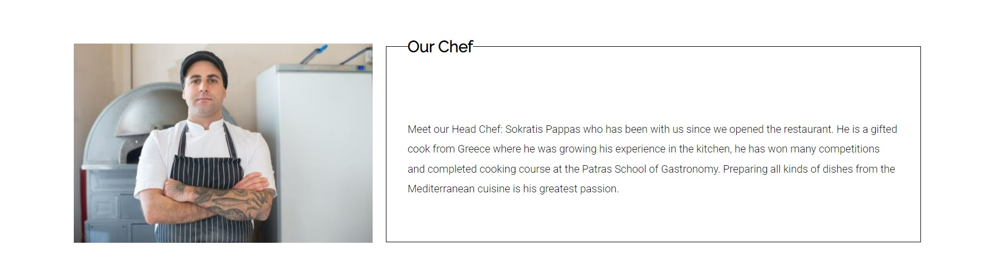

  
    
Our Guests

    Third section of the About us page, appears under the our chef feature. 
    Consists of a text with other guests reviews of the restaurant.  
    It is responsive, the text content reduces its width and increases the height. 
    User stories covered: 14.
    

    
Contact form

    Placed in the center of the page,, on the left side of the Contact page. 
    Includes a form with name, email, and phone inputs, a textarea, and a submit button for the user. 
    The form is responsive, adjusting the size to the viewport and moves above the map for medium size screens. 
    User stories covered: 6.
    

    
Map

    Placed in the center of the page, on the right side of the Contact page. 
    Includes an iframe map from Google Maps. 
    The map is responsive, moves below the form for medium size screens and reduces its size for smaller screens. 
    User stories covered: 15.
    

## Validation

### HTML Validation
To validate HTML of the website the W3C Markup Validation Service was used. The results have no errors.

#### Home

#### Menu
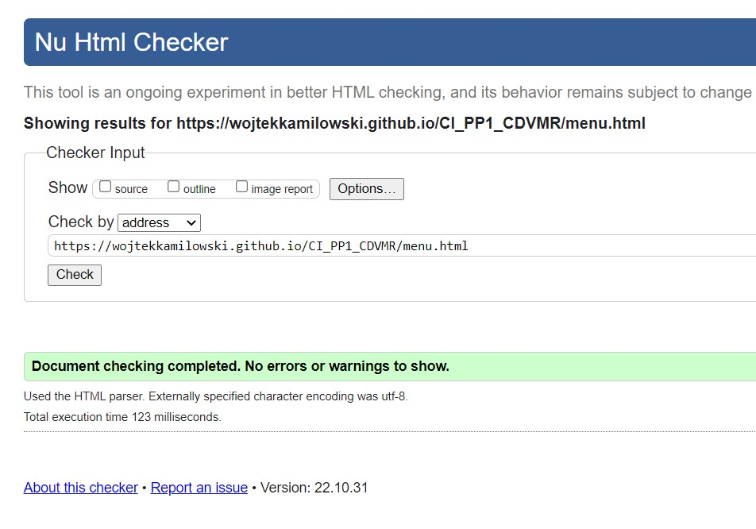

#### About us
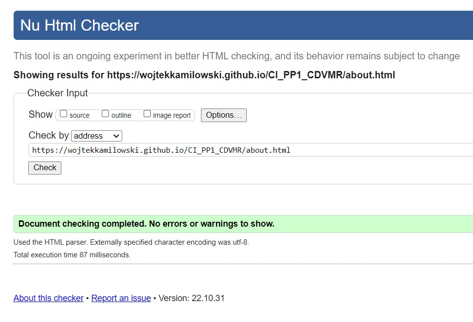

#### Contact

#### 404
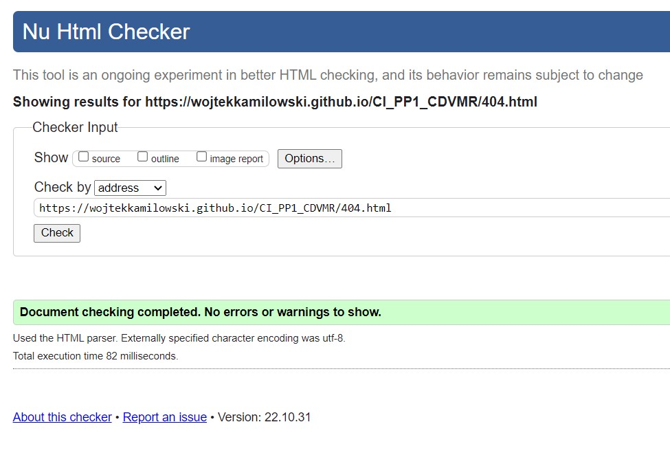

### CSS Validation
To validate style.css the W3C Jigsaw CSS Validation Service was used. There were no errors found.

## Accessibility
Accessibility was tested using WAVE - Web Accessibility Evaluation Tool. All of the pages have no errors.
An initial error regarding the contrast was fixed using WebAIM where a similar, however with a better contrast color was found for the background.

### Home

### Menu

### About us

### Contact

### 404
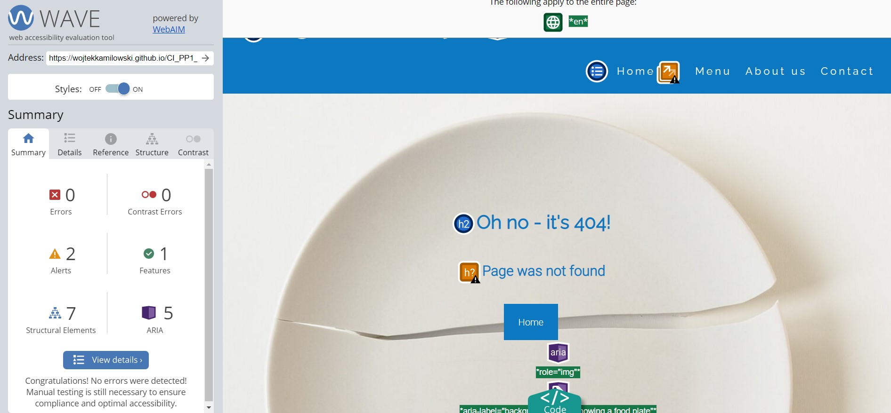

## Performance
The tool used to test the performance of the website was Google Lighthouse from Google Chrome Developer Tools.

### Home

#### Desktop

#### Mobile

### Menu

#### Desktop

#### Mobile

### About us

#### Desktop

#### Mobile

### Contact

#### Desktop

#### Mobile

### 404

#### Desktop

#### Mobile

## Device testing
List of devices used to test the website:
- HP Pavilion 14 
- Sony Xperia L2
- Motorola

The website was also tested using Google Chrome Developer Tools, Toggle Device Toolbar simulating view from twenty-five listed devices, including popular amongst users iPad and iPhone 5.

## Browser compatability
Following browsers were used to test the website:
- Google Chrome
- Mozilla Firefox
- Microsoft Edge

## Testing user stories 

1. As a first time user I want to know if there is some disruption to the usual opening times or other very important information:

| Feature | Action  | Expected Result | Actual Result |
| ------- | ------- | --------------- | ------------- |
| Announcements | On the home page scroll down to the Announcements | Find the information if the business is open as usual | Works as expected |

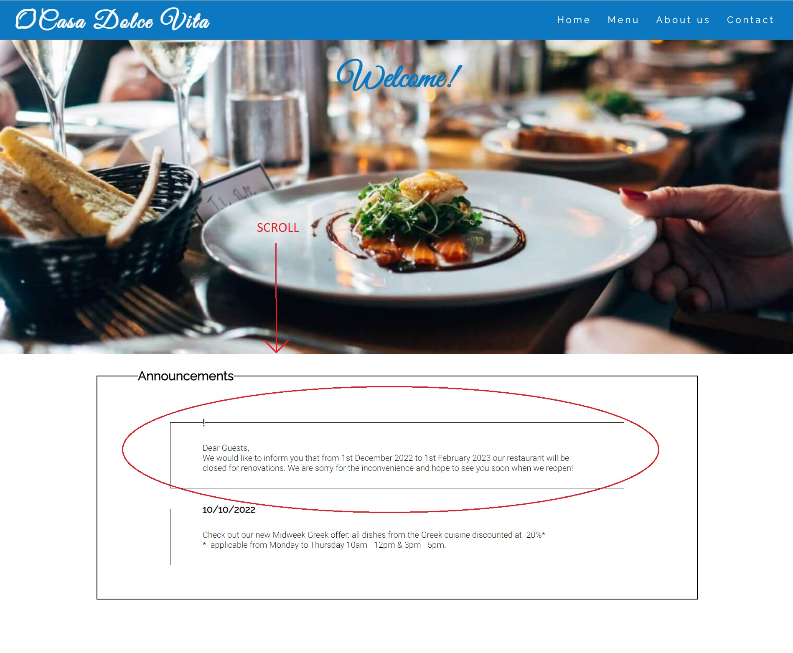

2. As a first time user I want to know when I can visit the place.

| Feature | Action  | Expected Result | Actual Result |
| ------- | ------- | --------------- | ------------- |
| Opening hours | On the home page scroll down to the Opening hours | Find the information about restaurant's opening hours | Works as expected |

3. As a first time user I want to know how to contact the restaurant via phone or email.

| Feature | Action  | Expected Result | Actual Result |
| ------- | ------- | --------------- | ------------- |
| Footer | On any page of the website scroll down to the very bottom to see restaurant's email address and phone number | Find restaurant's email address and phone number | Works as expected |

4. As a first time user I want to know the address of the premises.

| Feature | Action  | Expected Result | Actual Result |
| ------- | ------- | --------------- | ------------- |
| Footer | On any page of the website scroll down to the very bottom to see restaurant's address, click on it to open Google Maps with its location in a separate tab | Find restaurant's address and find its location on the map | Works as expected |

5. As a first time user I want to visit restaurant's social media platforms and check the activity on them.

| Feature | Action  | Expected Result | Actual Result |
| ------- | ------- | --------------- | ------------- |
| Footer | On any page of the website scroll down to the very bottom to see social media icons and click on them to open links of any of the pictured social media platforms | The social media websites open in a separate browser tab | Works as expected |

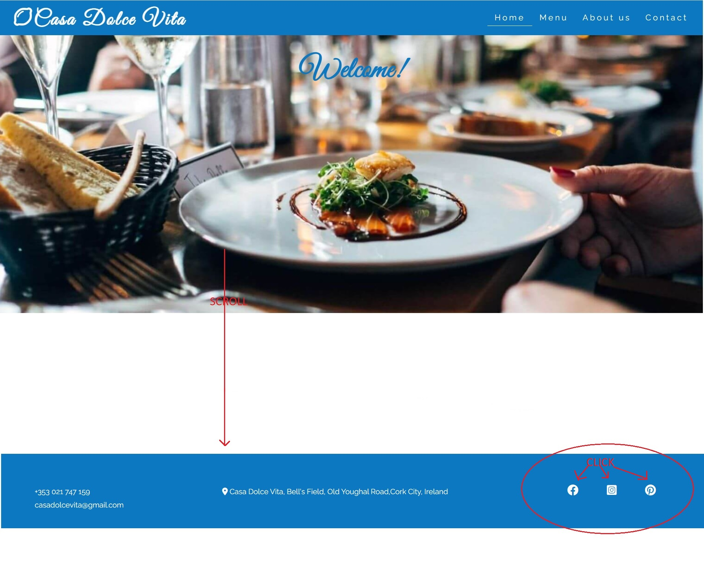

6. As a returning user I want to contact the management and inform about my feedback after a visit.

| Feature | Action  | Expected Result | Actual Result |
| ------- | ------- | --------------- | ------------- |
| Logo and Navigation Bar | Navigate to the contact page by clicking on Contact | Contact page opens | Works as expected  |
| Contact form | Fill up the form with the requested details | The input values are submitted via form correctly | Works as expected  |

7. As a returning user I want to check if there is a special offer available.

| Feature | Action  | Expected Result | Actual Result |
| ------- | ------- | --------------- | ------------- |
| Announcements | On the home page scroll down to the Announcements | Find if a special offer is available | Works as expected  |

8. As a returning user I want to check if the restaurant menu is same as during the last visit.

| Feature | Action  | Expected Result | Actual Result |
| ------- | ------- | --------------- | ------------- |
| Logo and Navigation Bar | Navigate to the menu page by clicking on Menu | Menu page opens | Works as expected  |
| Restaurant menu header and menu images | Navigate to the menu page using the Logo and Navigation Bar feature | See the images displaying what kind of food is served in the restaurant | Works as expected |
| Food Menu and Drinks Menu | On the menu page scroll below menu images | Find what is the food and drink offered and what is the price range | Works as expected  |

9. As the restaurant owner I want to advertise the place through presentation of food and drink served.

| Feature | Action  | Expected Result | Actual Result |
| ------- | ------- | --------------- | ------------- |
| Logo and Navigation Bar | Navigate to the menu page by clicking on Menu | Menu page opens | Works as expected  |
| Restaurant menu header and menu images | Navigate to the menu page using the Logo and Navigation Bar feature | The images display what kind of food guests can expect in the restaurant | Works as expected |
| Food Menu and Drinks Menu | On the menu page scroll below menu images | Present the offered food and drink with their prices | Works as expected |
| Plate image | Open the home page | Welcome the user and a potential guest of the restaurant wih a food plate in the background | Works as expected  |

10. As the restaurant owner I want to introduce what type of place the user can expect during the visit.

| Feature | Action  | Expected Result | Actual Result |
| ------- | ------- | --------------- | ------------- |
| Logo and Navigation Bar | Navigate to the about us page by clicking on About | About page opens | Works as expected  |
| Our Place | Navigate to the about us page using the Logo and Navigation Bar feature | Display the text descrbing the restaurant | Works as expected |

11. As the restaurant owner I want to reveal the interior design of the restaurant.

| Feature | Action  | Expected Result | Actual Result |
| ------- | ------- | --------------- | ------------- |
| Logo and Navigation Bar | Navigate to the about us page by clicking on About | About page opens | Works as expected  |
| Our Place | Navigate to the about us page using the Logo and Navigation Bar feature | Show the image of restaurant's interior | Works as expected |

12. As the restaurant owner I want to present the head chef to the user.

| Feature | Action  | Expected Result | Actual Result |
| ------- | ------- | --------------- | ------------- |
| Logo and Navigation Bar | Navigate to the about us page by clicking on About | About page opens | Works as expected  |
| Our Chef | Navigate to the about us page using the Logo and Navigation Bar feature and scroll below Our Place | Show the photo of restaurant's head chef | Works as expected |

13. As the restaurant owner I want to inform the user who manages preparation of the dishes and the professional background of this person.

| Feature | Action  | Expected Result | Actual Result |
| ------- | ------- | --------------- | ------------- |
| Logo and Navigation Bar | Navigate to the about us page by clicking on About | About page opens | Works as expected  |
| Our Chef | Navigate to the about us page using the Logo and Navigation Bar feature and scroll below Our Place | Display the text describing restaurant's head chef | Works as expected |

14. As the restaurant owner I want to share other guets reviews and what they felt during their dining experience.

| Feature | Action  | Expected Result | Actual Result |
| ------- | ------- | --------------- | ------------- |
| Logo and Navigation Bar | Navigate to the about us page by clicking on About | About page opens | Works as expected  |
| Our Guests | Navigate to the about us page using the Logo and Navigation Bar feature and scroll below Our Chef | Show restaurant's guests reviews | Works as expected |

15. As the restaurant owner I want to explain how to get to the restaurant and present its unique location.

| Feature | Action  | Expected Result | Actual Result |
| ------- | ------- | --------------- | ------------- |
| Logo and Navigation Bar | Navigate to the contact page by clicking on Contact | Contact page opens | Works as expected  |
| Map | Open the contact page using Logo and Navigation Bar feature | Present the location of the restaurant on Google Maps map | Works as expected |

16. As the restaurant owner I want to make the user feel welcomed and invited to visit the restaurant.

| Feature | Action  | Expected Result | Actual Result |
| ------- | ------- | --------------- | ------------- |
| Plate image | Open the home page | Welcome the user and a potential guest of the restaurant wih a food plate in the background | Works as expected  |

## Bugs
| Bug  | Fix  |
| ------- | ------- |
| When viewed on mobile devices the pages have a white line on the right side that goes after the header and footer | Remove excessive paddings & change some paddings values from px to vh/vw |
| Opening hours fieldset narrower than the Announcements fieldset they do not match on smaller screens | Adjust opening hours marginmedia queries with 

    
